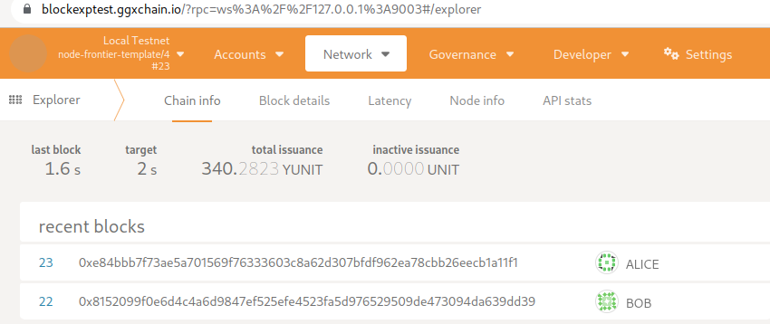
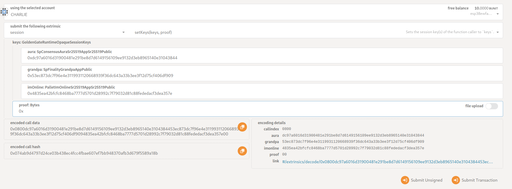
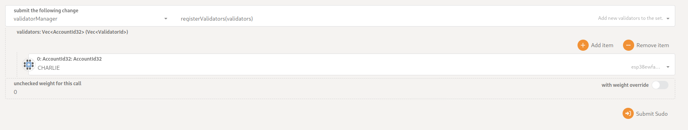
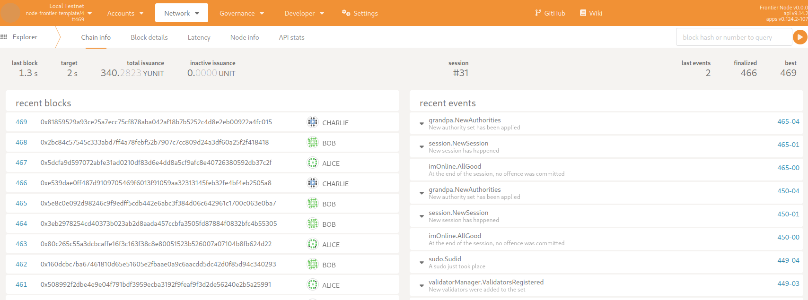
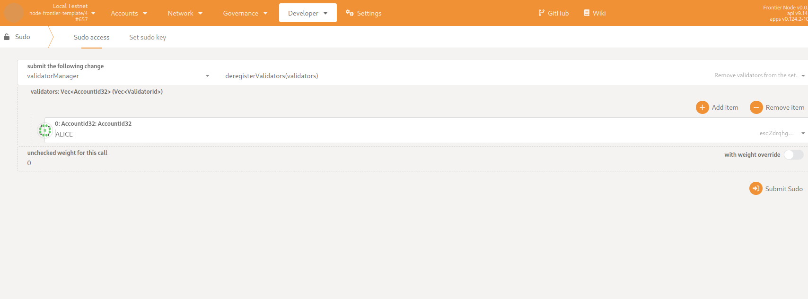
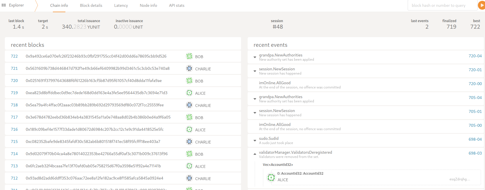

# Managing validator list

This document shows how to add and remove the validator.
Currently, the Golden Gate runs a Federated POA.
There are two ways to add or remove the validator:

* Using the sudo extrinsic to the validator_manager pallet.
* Modifying the genesis config

## SUDO mechanism

### Prerequisites

* We expect that you are familiar with how to set up and build our node
* This mechanism is executed in the runtime, and you are supposed to have a sudo privileged account.

Example:

```bash
# You can start a network using our nix flake file.
nix run .#multi-fast

# Alternatively, you can run nodes yourself in three different shells
cargo run --release -- --chain local --alice --tmp
cargo run --release -- --chain local --bob --tmp
cargo run --release -- --chain local --charlie --tmp --ws-port 9003
```

### Adding validator

Important:

* Please note, in our setup, Alice and Bob are validators initially, and we will add Charlie during the guide.
* Also, note that you must be connected to the validator you want to add (in our case, Charlie) to get a rotated key.
* For example, we set a session to 15 blocks (30 seconds). For you, it will take about 4 hours.

Steps:

* Validate that the network is working and that you can connect. Check that all validators behave properly.
As you can see, Alice and Bob are producing blocks, and I have connected to the 9003 port, which is Charlie's.

  
* We have to allowlist Charlie initially. How to allowlist the validator user see in the [guide](../adding-user-to-allowlist/README.md)
* Go to Develop/RPC tab in the block explorer.
* Submit RPC to the `author.rotateKeys()`

  
* Copy the received key
  * In our example is: `0xdc97a6016d31900481e291be8d7d6149156109ee9132d3eb8965140e3104384453ec873dc7f96e4e3119931120668939f36dc643a33b3ee3f12d75cf406df9094835ea42bfcfc8468ba7777d5701d28992c7f79032d81c88fededacf3dea357e`
* We have received three keys. (can be more later one). Each key is 32 bytes (64 symbols omitting initial 0x).

You have to split them into three separate parts as below (Runtime Calls -> sessionKeys -> decodeSessionKey):

* Aura: `0xdc97a6016d31900481e291be8d7d6149156109ee9132d3eb8965140e31043844`
* Grandpa: `0x53ec873dc7f96e4e3119931120668939f36dc643a33b3ee3f12d75cf406df909`
* I'm online: `0x4835ea42bfcfc8468ba7777d5701d28992c7f79032d81c88fededacf3dea357e`
* Go to the Developer/Extrinsics and submit the `session.setKeys` transaction

  
  * Fill the data with your keys
  * proof: `0x`

* Submit the transaction and sign it.
* Go to the Developer/Sudo tab and choose `validatorManager.registerValidator` transaction



* Submit sudo and sign the transaction.
* The validator is supposed to become active in two sessions. Verify that it is working.

  
* As you can see, Charlie becomes a validator.

### Removing validator

* Go to the Developer/Sudo tab and choose validatorManager.deregisterValidator transaction
* Choose the validator you want to remove

  
* Submit sudo and sign the transaction.
* The validator is supposed to become inactive in two sessions. Verify that it was removed.

  
* As you can see, Alice is not a validator anymore.

## Genesis config

You can specify initial validators in the GenesisConfig into the session pallet.
The pallet accepts AccountId and SessionKeys for each validator.

```rust
session: SessionConfig {
    keys: initial_authorities
        .iter()
        .map(|x| -> (AccountId, AccountId, SessionKeys) {
            (
                x.id.clone(),
                x.id.clone(),
                SessionKeys {
                    aura: x.aura.clone(),
                    grandpa: x.grandpa.clone(),
                    im_online: x.im_online.clone(),
                },
            )
        })
        .collect::<Vec<_>>(),
},
```
