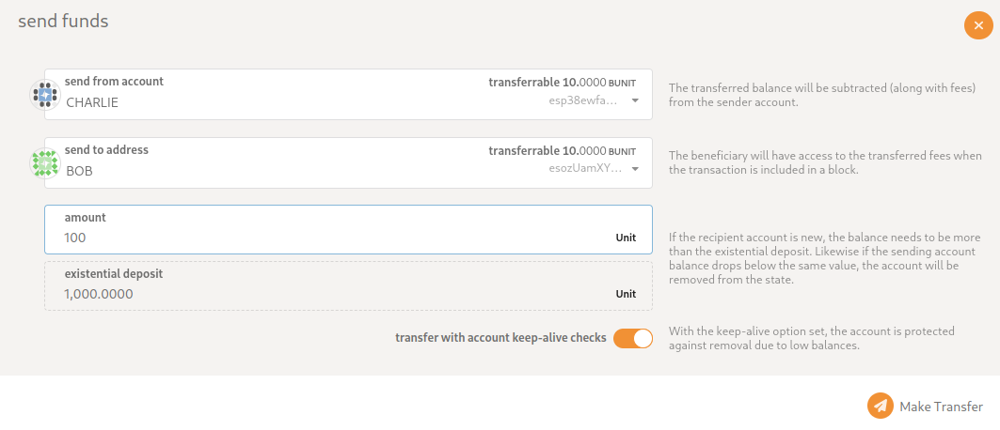
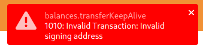
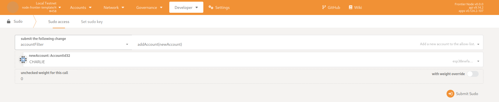
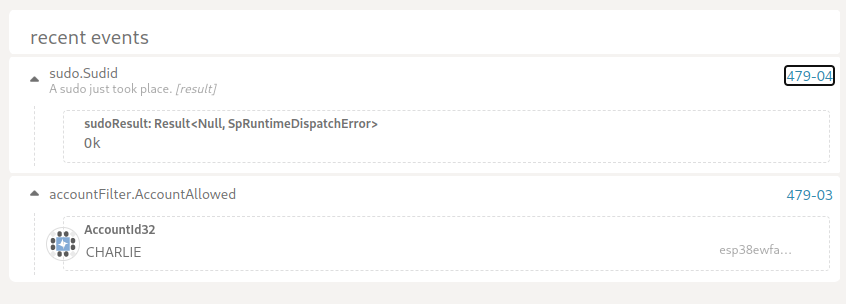

## Adding a user to allowlist
This document shows how to add the user to the allowlist.
Currently, the Golden Gate allows only the user from the allowlist to interact with the chain.
There are two ways to add the user to the allowlist:
* Using the sudo extrinsic to the account_filter pallet.
* Modifying the genesis config

### Making transactions from an unlisted account
* Let's make a transaction from the charlie account.
* Open the Accounts/Transfer tab.
* Fill in the data that Charlie is the sender and Bob is the receiver
* 
* Send transfer
* Verify an error happened
* 

### SUDO mechanism

#### Prerequisites
* We expect that you are familiar with how to set up and build our node
* This mechanism is executed in the runtime, and you are supposed to have a sudo privileged account.

Example:
```
# You can start a network using our nix flake file.
nix run .#single-fast

# Alternatively, you can run nodes yourself
cargo run --release -- --dev

# You can connect now to the default 9944 port via polkadot block explorer or our own
```

#### Adding user
* Open Developer/Sudo pallet
* Fill in the required data to add Charlie
* 
* Press submit sudo and sign the transaction.
* Check events to verify that the user is allow listed
*  
* Charlie should be able to make a transaction now.

### Genesis config
* You can add initial users to GenesisConfig (chain_spec.rs file). The allowlist accepts a list of account ids.
* ```
  // Example
  account_filter: AccountFilterConfig {
    allowed_accounts: initial_authorities
	    .clone()
	    .into_iter()
	    .map(|e| (e.id, ()))
	    .collect(),
  }
  ```
* The user will be able to make transaction from the beginning as Alice in example.