This document will show you how to use the cross-VM communication feature of the Golden Gate.

## Prerequisites
### Ubuntu

```
# We need the following to compile WASM smart contracts
sudo apt-get -y install binaryen protobuf
rustup component add rust-src
rustup component add rust-src --toolchain nightly-unknown-linux-gnu
rustup target add wasm32-unknown-unknown
cargo +nightly install cargo-dylint dylint-link
cargo +nightly install cargo-contract

# Start a node with the Golden Gate runtime from the root of the repository
cargo run --release -- --dev
```

### MacOS

```
# We need the following to compile WASM smart contracts
brew install binaryen protobuf
rustup component add rust-src
rustup component add rust-src --toolchain nightly-x86_64-apple-darwin
rustup target add wasm32-unknown-unknown
cargo +nightly install cargo-dylint dylint-link
cargo +nightly install cargo-contract

# Start a node with the Golden Gate runtime from the root of the repository
cargo run --release -- --dev

```

### Docker
Alternatively, you can use provided docker file to build contracts and run the node.
```
cd golden-gate # go to the root of the repository
docker build -t golden-gate-env -f containers/enviroment . # build the docker image
docker run -it -p 9944:9944 -p 9933:9933 -v $(pwd):/golden-gate golden-gate-env bash # run the docker image
cd golden-gate # go to the root of the repository
cargo run --release -- --dev --ws-external --rpc-external # start the node
```

## Building the Polkadot UI
This step is mandatory until https://github.com/polkadot-js/apps/pull/8538 is merged.
```
# Clone the Polkadot UI repository
git clone https://github.com/niklabh/apps.git
cd apps
yarn install
yarn run start
# The UI will be available at http://localhost:3000
```

## EVM to WASM communication
In this chapter, we will run a simple contract on WASM and call it from the EVM.

### Flipper WASM contract
The Flipper contract is a simple contract that allows you to flip a boolean value. It is written in Rust and compiled to WASM. The source code can be found in the `evm_to_wasm/flipper` directory. The contract will produce an event `Flipped(bool)` when the value is flipped.

### Building the contract
```
# The contract will be located in evm-to-wasm/flipper/target/ink/flipper.contract
cargo +nightly contract build --manifest-path evm-to-wasm/flipper/Cargo.toml
```

### Deploying the contract
* Go to the [Contracts](http://localhost:3000/?rpc=ws%3A%2F%2F127.0.0.1%3A9944#/contracts) page
* Click on the "Upload & deploy code" button
  * Deployment account: `Alice`
  * JSON for either ABI or .contract bundle: `examples/cross-vm-communication/evm-to-wasm/flipper/target/ink/flipper.contract` 
* Click `Next`, then `Deploy` and then `Sign and Submit`. You are supposed to see the green notification that the contract was deployed successfully on the top right corner of the page. Example:
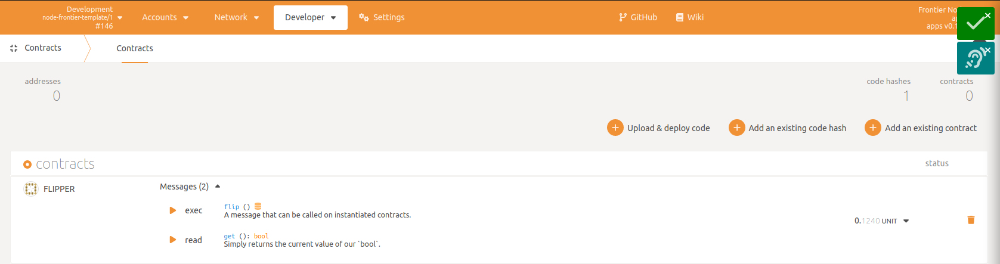
* Try to execute a `flip` method.
  * Click on the `exec` button nearby with the `flip` method.
  * Click on the `Execute` button and then `Sign and Submit`. You are supposed to see the green notification that it succeed.
* Go to the [explorer](http://localhost:3000/?rpc=ws%3A%2F%2F127.0.0.1%3A9944#/explorer) page. You are supposed to see an event. Example:
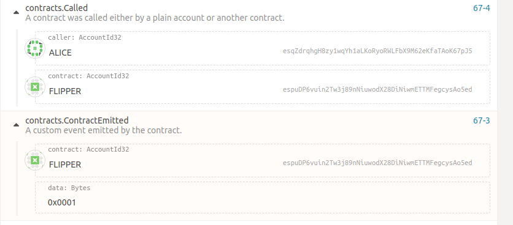

### Calling from the EVM
* Go to the [Contracts](http://localhost:3000/?rpc=ws%3A%2F%2F127.0.0.1%3A9944#/contracts) page
* Click on the contract icon to copy the address

  
* Go to the root of the repository and run the following command:
  `cargo run --release -- key inspect $YOUR_ADDRESS`
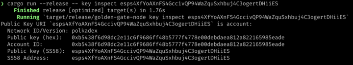
* Copy the public key in hex format. Also, please add 00 at the beginning of the key. The final key should look like this: `0x00b6e7d9cf2782e61385755e4675194716f86b808f161a3ab7cd0ca36714dad8da`
* Go to the Metamask extension, click on the active network and click `Add network`. 
 
  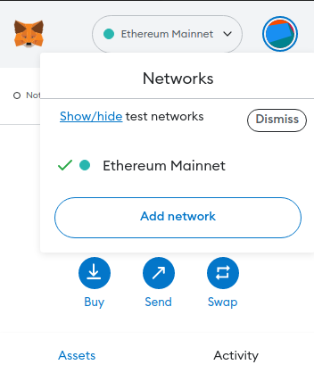
* You will be redirected to the website with the network settings. Click on the `Add a network manually` button at the bottom of the page. Fill in the following fields:
  * Network name: `Golden Gate`
  * New RPC URL: `http://localhost:9933`
  * Chain ID: `66`.
  * Currency symbol: `GGX`
  * Block explorer URL: None
* Click on the user icon nearby with a network selector on the top of the page.  You are supposed to see the `My accounts` section. Click on the `Import account` button

  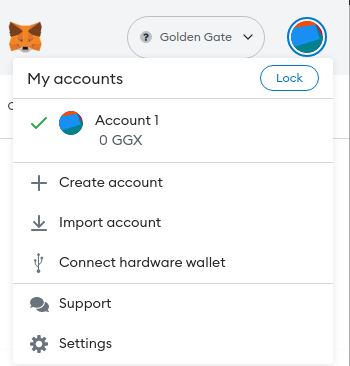

* Enter the next private key `0x01ab6e801c06e59ca97a14fc0a1978b27fa366fc87450e0b65459dd3515b7391`. This account has prefilled balance. You have successfully imported the account, and see something like this in Metamask:

  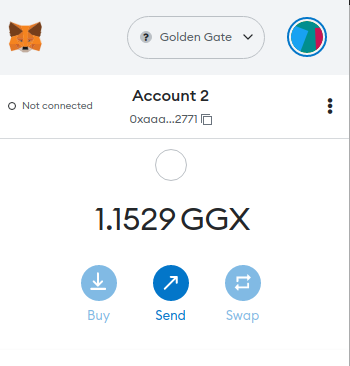

* Open [remix ide](https://remix.ethereum.org/#) and create a new file with the data from the `evm-to-wasm/xvm.sol` file.
* Compile the code
* Go to the "Deploy & Run Transactions" tab and change the environment to "Injected Metamask"
* Put the `0x0000000000000000000000000000000000005005` address of XVM precompile in `Load contract from address` field and click `At Address`. 

  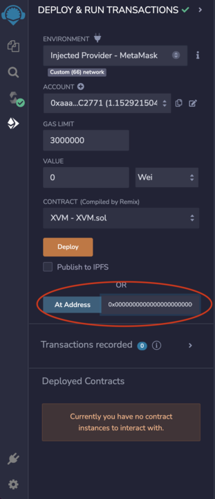
* The contract should appear in the `Deployed Contracts` section. Let's fill in the required data.
  
  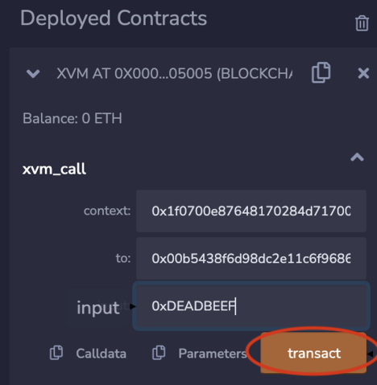

  * context: `0x1f0700e87648170284d71700`. The value is data encoded using `parity-scale-codec`, which is derived as follows:
    * `1f` is an ID of the WASM VM
    * `0700e8764817` - is 100000000000 ref time (weight system v2) in the context of gas
    * `0284d717` - is 100000000 proof time (weight system v2) in the context of gas
    * `00` is None for the environment
  * to: the address of the Flipper contract from the above. Don't forget about leading `00`. In our case, it would be `0x00b5438f6d98dc2e11c6f9686ff48h5777f4778e86debdaea812a822165985eade`
  * input: we should put here a method selector from ink. The selector is an index for the method in the contract. In our case, it is `0xDEADBEEF` for the flip method. You can see it in the evm-to-wasm/flipper/lib.rs:40
  * Click transact and modify the gas price in the Metamask to at least 0.01 GGX (Currently, estimation of the gas price between VM is not implemented). The transaction should be successful.
  
  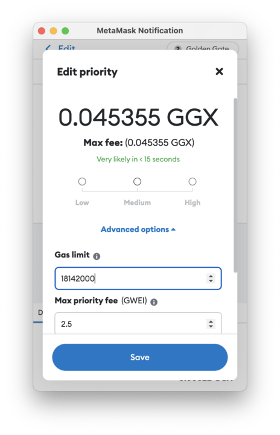

  * Scroll down to the end in the Metamask and click "Confirm".
  
  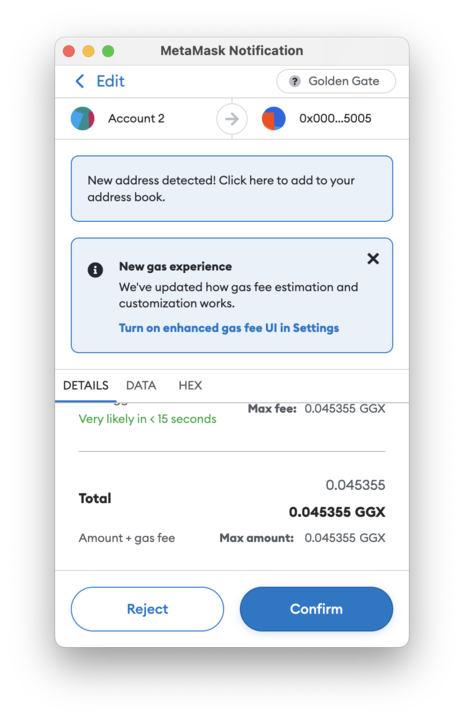

* You are supposed to see the green notification in the console of the Remix IDE.
  
  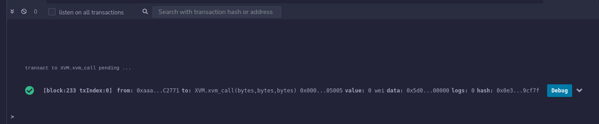

* You can go to the [explorer tab](http://localhost:3000/?rpc=ws%3A%2F%2F127.0.0.1%3A9944#/explorer) and check the events from the contract. You are supposed to see something like this:
  
  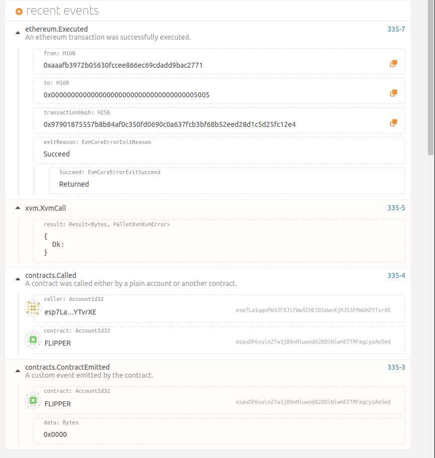

* Congratulations! You have successfully called the WASM contract from the EVM.

## WASM to EVM communication
In this chapter, we will create a simple contract on the EVM side and call it from the WASM.

### Flipper EVM contract
The Flipper contract is a simple contract that allows you to flip a boolean value. It is written in Solidity and compiled to EVM. The source code can be found in the `wasm_to_evm/flipper.sol` file.

#### Deploy the EVM contract
* Go to the [Remix IDE](https://remix.ethereum.org/#) and create a new file with the data from the wasm-to-evm/flipper.sol file.
* Inject Metamask as in the previous chapter
* Compile the code
* Deploy the contract with estimated gas.
* The contract should appear in the Deployed contract section. You can play with it if you want.

  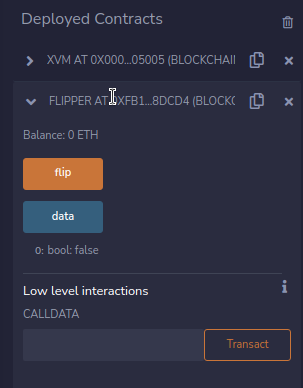

* The selector for the `flip` method is `0xcde4efa9`. You can get a solidity selector from [the tool](https://abi.hashex.org/) or other similar tools.

### Flipper WASM contract
We need a wrapper around the EVM contract. The wrapper will allow us to call the EVM contract from the WASM. The source code can be found in the `wasm_to_evm/flipper/lib.rs` file.

#### Building the contract
```
# The contract will be located in wasm-to-evm/flipper/target/ink/flipper.contract
cargo +nightly contract build --manifest-path wasm-to-evm/flipper/Cargo.toml
```

#### Deploying the contract
* Go to the [Contracts](http://localhost:3000/?rpc=ws%3A%2F%2F127.0.0.1%3A9944#/contracts) page
* Deploy the contract. Click `Upload & deploy code`
  * deployment account: Alice
  * JSON for either ABI or .contract bundle: `examples/cross-vm-communication/wasm-to-evm/flipper/target/ink/flipper.contract`
  * Click `Next`, then `Deploy` and then `Sign and Submit`. You are supposed to see the green notification on top of the page.
  
    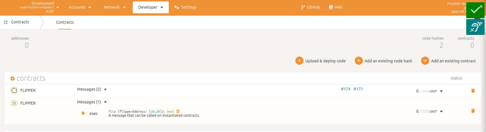

* Exec the flip method
  * Call from account: `Alice`
  * flipperAddress: specify the address of the EVM contract from the Remix in hex.
  
    
  
  * Click the `Execute` button, and then `Sign and Submit`. You are supposed to see the green notification on top of the page.
  
    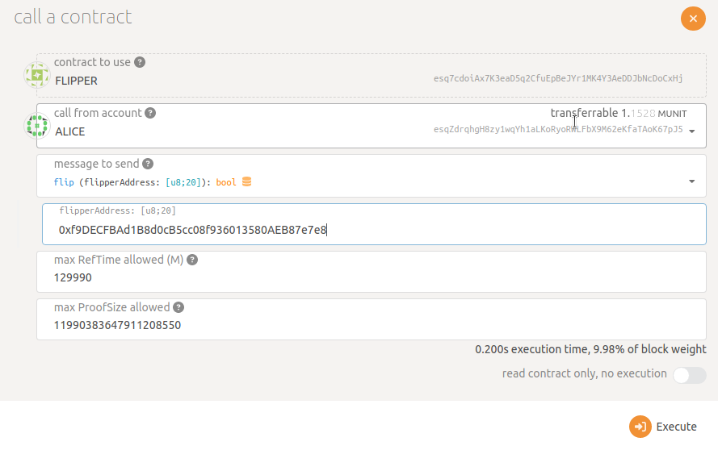

* Go to [explorer](http://localhost:3000/?rpc=ws%3A%2F%2F127.0.0.1%3A9944#/explorer). You are supposed to see events like this

  

* Also, you can go to Remix and click `get` method to see that the value has been changed.
* Congratulation, you are successfully called the EVM contract from the WASM environment.
