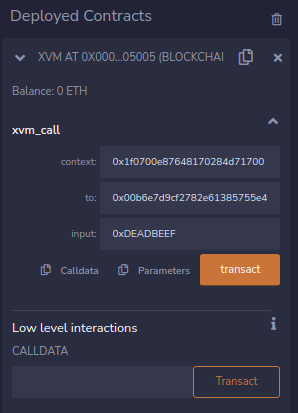
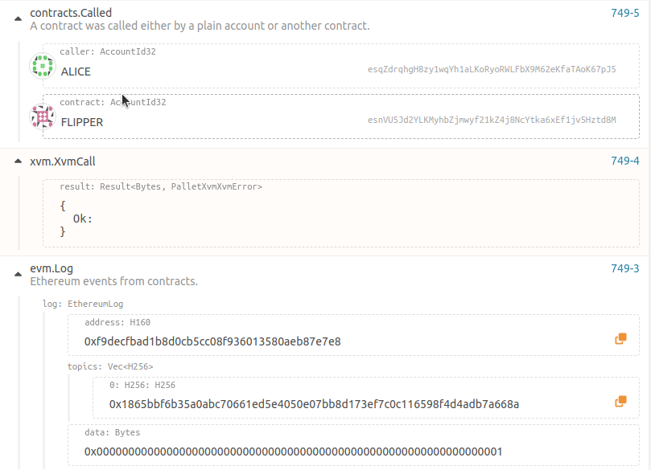

This document will show you how to use the cross-VM communication feature of the Golden Gate.

## Prerequisites
### Ubuntu example
```
# We need it to compile the WASM contract
sudo apt-get -y install binaryen
cargo install cargo-contract

# Start a node with the Golden Gate runtime from the root of the repository
cargo run --release -- --dev
```

#### Building the Polkadot UI
This step is mandatory until https://github.com/polkadot-js/apps/pull/8538 won't be merged.
```
# Clone the Polkadot UI repository
git clone https://github.com/niklabh/apps.git
yarn run start
# The UI will be available at http://localhost:3000
```

## EVM to WASM communication
In this chapter, we will run a simple contract on WASM and call it from the EVM.

### Flipper WASM contract
The Flipper contract is a simple contract that allows you to flip a boolean value. It is written in Rust and compiled to WASM. The source code can be found in the `evm_to_wasm/flipper` directory. The contract will produce an event `Flipped(bool)` when the value is flipped.

### Building the contract
```
# The contract will be located in evm-to-wasm/flipper/target/ink/flipper.contract
cargo contract build --manifest-path evm-to-wasm/flipper/Cargo.toml
```

### Deploying the contract
* Go to the [Contracts](http://localhost:3000/?rpc=ws%3A%2F%2F127.0.0.1%3A9944#/contracts) page
* Click on the "Developer/Contracts" tab
* Click on the "Upload & deploy code" button
* Choose Alice as the sender
* Put the path to the contract file (evm-to-wasm/flipper/target/ink/flipper.contract) in the "Upload from file" field
* Deploy it
* Try to execute a flip method and check the event in the [explorer tab](http://localhost:3000/?rpc=ws%3A%2F%2F127.0.0.1%3A9944#/explorer)
* You are supposed to see contracts.ContractEmitted 

Example result:


### Calling from the EVM
* Go to the [Contracts](http://localhost:3000/?rpc=ws%3A%2F%2F127.0.0.1%3A9944#/contracts) page
* Click on the contract icon to copy the address 
* Go to the root of the repository and run the following command:
  `cargo run --release -- key inspect $YOUR_ADDRESS` 
* Copy the public key in hex format. Also, please add 00 at the beginning of the key. The final key should look like this: `0x00b6e7d9cf2782e61385755e4675194716f86b808f161a3ab7cd0ca36714dad8da`
* Add the new network in the Metamask. The network name should be `Golden Gate` and the RPC URL should be `http://localhost:9933`, the chain ID should be `66`.
* Add the prefilled account to the Metamask. The private key is `0x01ab6e801c06e59ca97a14fc0a1978b27fa366fc87450e0b65459dd3515b7391`
* Open [remix ide](https://remix.ethereum.org/#) and create a new contract with the data from the evm-to-wasm/xvm.sol file.
* Compile the code
* Go to the "Deploy & Run Transactions" tab and change the environment to "Injected Metamask"
* Put the `0x0000000000000000000000000000000000005005` address of XVM precompile in `Load contract from address` field and click `At Address`. 
* The contract should appear in the `Deployed Contracts` section. Let's fill in the required data.
  * context: `0x1f0700e87648170284d71700` where:
`1f` is an ID of the WASM contract
    * `0700e8764817` - is 100000000000 ref time (weight system v2) in the context of gas
    * `0284d717` - is 100000000 proof time (weight system v2) in the context of gas
    * `00` is None for the environment
  * to: the address of the Flipper contract from the above. Don't forget about leading `00`. In our case, it would be `0x00b6e7d9cf2782e61385755e4675194716f86b808f161a3ab7cd0ca36714dad8da`
  * input: we should put here a method selector from ink. The selector is an index for the method in the contract. In our case, it is `0xDEADBEEF` for the flip method. You can see it in the evm-to-wasm/flipper/lib.rs:40
  * Example: 
  * Click transact and modify the gas price in the Metamask to at least 0.1 GGX (Currently, estimation of the gas price between VM is not implemented). The transaction should be successful.
  * You can go to the [explorer tab](http://localhost:3000/?rpc=ws%3A%2F%2F127.0.0.1%3A9944#/explorer) and check the events from the contract. You are supposed to see something like this: 

## WASM to EVM communication
In this chapter, we will create a simple contract on the EVM side and call it from the WASM.

### Flipper EVM contract
The Flipper contract is a simple contract that allows you to flip a boolean value. It is written in Solidity and compiled to EVM. The source code can be found in the `wasm_to_evm/flipper.sol` file.

#### Deploy the EVM contract
* Go to the [Remix IDE](https://remix.ethereum.org/#) and create a new contract with the data from the wasm-to-evm/flipper.sol file.
* Inject Metamask as in the previous chapter
* Compile the code
* Deploy the contract with estimated gas.
* The contract should appear in the Deployed contract section. . You can play with it if you want.
* The selector for the `flip` method is `0xcde4efa9`. You can get solidity selector from [the tool](https://abi.hashex.org/) or other similar tools.

### Flipper WASM contract
We need a wrapper around the EVM contract. The wrapper will allow us to call the EVM contract from the WASM. The source code can be found in the `wasm_to_evm/flipper/lib.rs` file.

#### Building the contract
```
# The contract will be located in wasm-to-evm/flipper/target/ink/flipper.contract
cargo contract build --manifest-path wasm-to-evm/flipper/Cargo.toml
```

#### Deploying the contract
* Go to the [Contracts](http://localhost:3000/?rpc=ws%3A%2F%2F127.0.0.1%3A9944#/contracts) page
* Deploy the contract using wasm-to-evm/flipper/target/ink/flipper.contract
* Use flip method and specify the address of the EVM contract as the first argument. The address should be in hex.
* Go to [explorer](http://localhost:3000/?rpc=ws%3A%2F%2F127.0.0.1%3A9944#/explorer). You are supposed to see events like this 