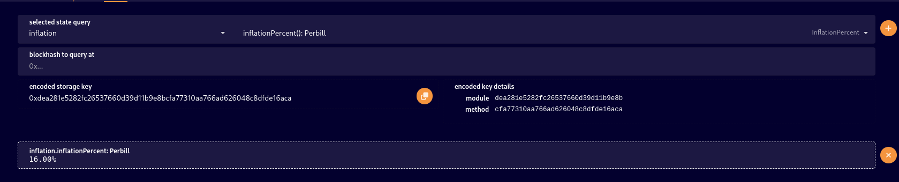
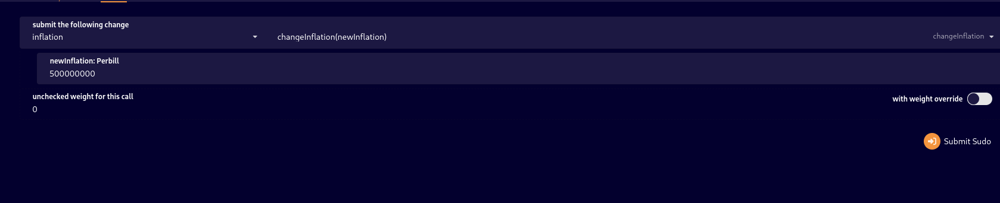
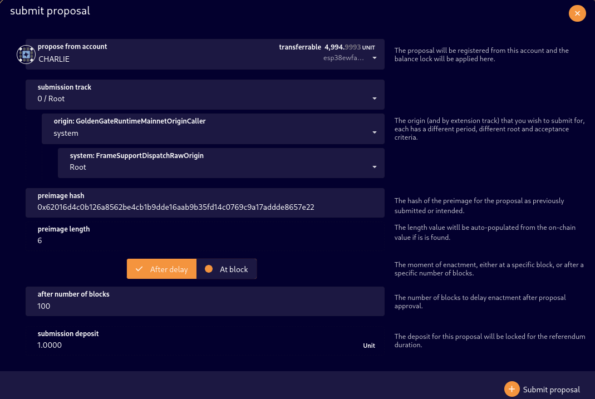
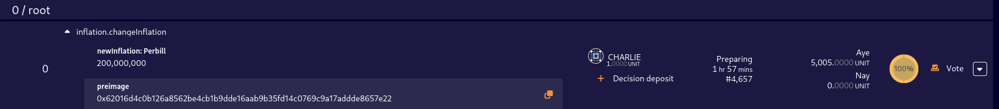
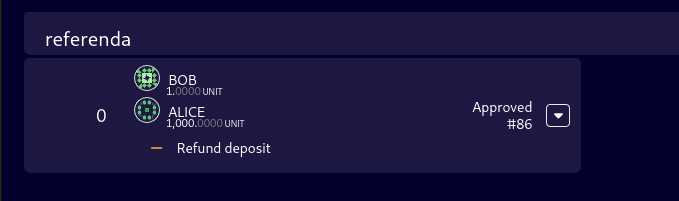
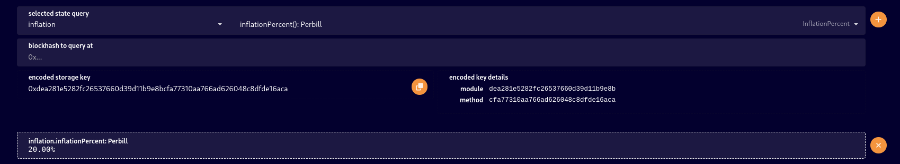

# Mainnet inflation management

> Please note, inflation was renamed to currencyManager

We have fixed inflation 16% per year configured by genesis initially.
Validators are receiving its portion (stake dependent to total issuance) on the end of the era.
The inflation can be managed by sudo or referendum.

## Getting inflation percent

* Go to the [chain state](https://blockexptest.ggxchain.io/#/chainstate) tab.
* Select `currencyManager.inflationPercent` query and click on the plus icon.

  

## Changing inflation by sudo

* Go to the [sudo](https://blockexptest.ggxchain.io/#/sudo) tab
* Choose `currencyManager.changeInflation` from drop down menus. Choose new value.
Please note that the value represented as integer per billion. So 500'000'000 represents 50%.

  
* Click `Submit Sudo` followed by `Sign and Submit`.
* If we check chain state now, we will see changed inflation percent

  

## Changing inflation by referenda

* Go to the [preimages](https://blockexptest.ggxchain.io/#/preimages) tab.
* Click on the `Add preimage`
* Choose `currencyManager.changeInflation` from dropdown menu

  
* Copy the created preimage hash.
  * In our example it's: `0x62016d4c0b126a8562be4cb1b9dde16aab9b35fd14c0769c9a17addde8657e22`
* Go to the [referenda](https://blockexptest.ggxchain.io/#/referenda) tab.
* Click the `Submit proposal` and enter preimage hash.

  
* Click `Submit proposal` and sign it.
* Now, the users can vote and choose if they like your change.

  
* After the vote period, the change will be applied.

  
  
